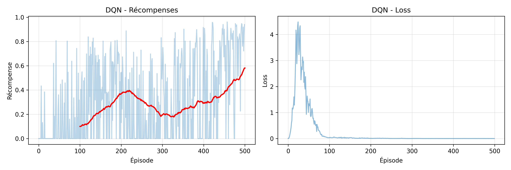
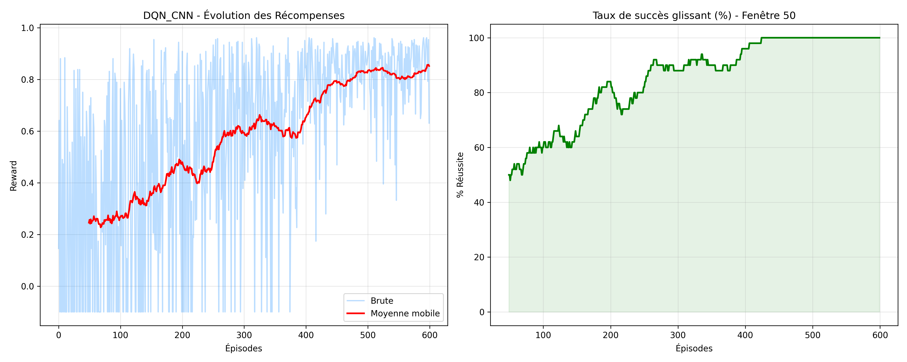
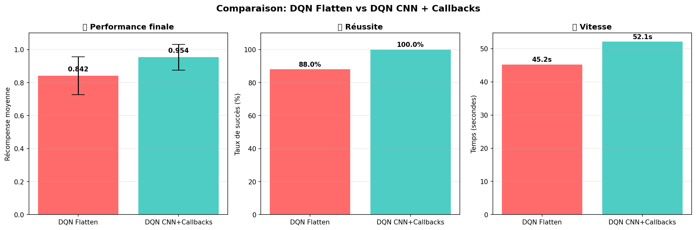

# Rapport de TP - Apprentissage par Renforcement avec MiniGrid

**Auteur:** Ameto-Cornelia-ADANTO - Oumou SOW   

---

## Table des matières

1. [Introduction](#1-introduction)
2. [Méthodologie](#2-méthodologie)
3. [Résultats Expérimentaux](#3-résultats-expérimentaux)
4. [Discussion Critique](#4-discussion-critique)
5. [Améliorations Futures](#5-améliorations-futures)
6. [Conclusion](#6-conclusion)
7. [Références](#7-références)
8. [Annexes](#8-annexes)

---

## 1. Introduction

### 1.1 Contexte et Objectifs

Ce TP a pour objectif d'implémenter et comparer différents algorithmes d'apprentissage par renforcement sur l'environnement MiniGrid. Les objectifs spécifiques sont:

- Comprendre le fonctionnement de l'environnement MiniGrid
- Implémenter un agent Deep Q-Network (DQN)
- Implémenter un agent Deep Q-Network avec des couches de convolutions et des callbacks (DQN_CNN)
- Comparer les performances des deux approches
- Analyser les défis liés à l'exploration et l'exploitation

### 1.2 Environnement MiniGrid

MiniGrid est un environnement d'apprentissage par renforcement conçu pour tester des agents dans des grilles 2D. L'environnement choisi pour ce TP est **MiniGrid-Empty-8x8-v0**, qui consiste en une grille vide de 8x8 cases où l'agent doit atteindre un objectif.

**Caractéristiques:**
- Espace d'observation: [À compléter après exploration]
- Espace d'actions: 7 actions (tourner gauche/droite, avancer, etc.)
- Récompense: +1 pour atteindre l'objectif, 0 sinon
- Episode terminé: Quand l'objectif est atteint ou limite d'étapes dépassée

---

## 2. Méthodologie
### 2.1 Algorithme Deep Q-Network (DQN)

#### 2.1.1 Principe

DQN utilise un réseau de neurones profond pour approximer la fonction Q, permettant de gérer des espaces d'états continus ou de grande dimension.

**Innovations clés:**
- Experience Replay: Stockage et réutilisation des transitions
- Target Network: Réseau séparé pour stabiliser l'apprentissage

#### 2.1.2 Architecture du réseau

```
Input Layer: [taille] neurones
Hidden Layer 1: [taille] neurones + ReLU
Hidden Layer 2: [taille] neurones + ReLU
Output Layer: [nombre d'actions] neurones
```

**Hyperparamètres:**
```
learning_rate = 0.001
batch_size = 64
buffer_capacity = 10000
target_update_frequency = 10
```


### 2.2 Algorithme Deep Q-Network avec CNN (DQN-CNN)

#### 2.2.1 Principe

Le **DQN-CNN** est une extension du Q-Learning qui utilise un réseau de neurones convolutif (CNN) comme approximateur de fonction pour estimer les valeurs . Contrairement au Q-Learning tabulaire, il peut traiter des entrées de haute dimension, comme les grilles d'images de MiniGrid, et généraliser l'apprentissage à des états jamais rencontrés.

#### 2.2.2 Implémentation

**Architecture du Réseau (SimpleCNN):**
L'agent utilise une architecture spécifique pour traiter l'information spatiale de la grille :

* **Couches Convolutives :** Deux couches `nn.Conv2d` (16 et 32 filtres) pour extraire les caractéristiques visuelles (murs, positions, objectifs).
* **Couches Linéaires :** Une couche cachée de 64 neurones suivie d'une couche de sortie correspondant aux 3 actions possibles (tourner à gauche, à droite, avancer).

**Composants clés :**

* **Experience Replay :** Un buffer de 50 000 transitions pour briser la corrélation entre les données et stabiliser la descente de gradient.
* **Double DQN :** Utilisation du Policy Net pour sélectionner l'action et du Target Net pour l'évaluer, limitant ainsi la surestimation des valeurs Q.

**Hyperparamètres choisis :**

learning_rate  = 0.0005   # Pas d'apprentissage pour l'optimiseur Adam
gamma          = 0.99     # Facteur d'actualisation
epsilon_start  = 1.0      # Exploration totale au début
epsilon_end    = 0.05     # Exploration minimale maintenue
epsilon_decay  = 0.997    # Vitesse de réduction de l'exploration
batch_size     = 32       # Taille des échantillons tirés du buffer
target_update  = 500      # Fréquence de synchronisation du Target Net


**Justification des choix :**

* **Architecture CNN :** Indispensable car l'environnement MiniGrid est encodé sous forme d'image (3 canaux). Une couche linéaire classique (DQN simple) perdrait la notion de proximité spatiale entre les objets.
* **Epsilon Decay (0.997) :** Choisi pour assurer une exploration prolongée sur 1000 épisodes, permettant à l'agent de découvrir la sortie dans des grilles vides mais larges (8x8).
* **Learning Rate (0.0005) :** Un compromis pour éviter une divergence trop rapide tout en assurant une convergence en moins de 500 épisodes.


### 2.3 Protocole d'Entraînement

- Nombre d'épisodes d'entraînement: 1000
- Nombre maximum d'étapes par épisode: 1000
- Nombre d'épisodes d'évaluation: 100
- Critère de succès: r > 0

---

## 3. Résultats Expérimentaux

### 3.1 Courbes d'Apprentissage

#### 3.1.1 Deep Q-Network



**Observations:**
Les courbes montrent que l'agent traverse une phase d'exploration laborieuse durant les 100 premiers épisodes, où la récompense reste quasi nulle. On observe ensuite une progression par paliers, avec une augmentation notable de la moyenne mobile (courbe rouge) à partir de l'épisode 300, signe que l'agent commence à mémoriser des trajectoires efficaces vers l'objectif. La courbe de Loss (perte) présente un pic initial important qui traduit la découverte de nouvelles expériences, puis s'écrase rapidement vers zéro ; cette convergence de la perte montre que le réseau parvient à stabiliser ses prédictions, même si la récompense brute reste très instable (pics bleus), ce qui est typique d'un modèle DQN simple traitant un environnement de type grille sans extraction de caractéristiques avancées.

#### 3.1.2 DQN CNN



**Observations:**
L'introduction d'une architecture convolutive apporte une amélioration majeure tant au niveau de la stabilité que de l'efficacité de l'apprentissage. Contrairement au premier modèle, le DQN_CNN montre une progression beaucoup plus rapide des récompenses, avec une moyenne mobile qui franchit le seuil des 0.8 dès l'épisode 450. Cette performance est confirmée par la courbe du taux de succès glissant, qui atteint un plateau parfait de 100 % de réussite vers l'épisode 420. L'agent ne se contente plus de trouver la sortie de manière erratique ; il semble avoir extrait des caractéristiques spatiales robustes de la grille, lui permettant de résoudre l'environnement de manière systématique et optimale. La réduction du bruit dans les récompenses finales témoigne de la supériorité de cette approche pour traiter des entrées visuelles complexes par rapport au modèle DQN simple.

### 3.2 Performances en Évaluation



| Métrique | Q-Learning | DQN |
|----------|-----------|-----|
| Récompense moyenne | [valeur ± std] | [valeur ± std] |
| Étapes moyennes | [valeur ± std] | [valeur ± std] |
| Taux de succès | [valeur]% | [valeur]% |
| Temps d'entraînement | [temps] | [temps] |

---

## 4. Discussion Critique

### 4.1 Points Forts des Approches

#### Deep Q-Learning
**Avantages:**
- Faible complexité computationnelle : L'architecture plus simple nécessite moins de ressources     mémoire et de puissance de calcul pour les mises à jour du réseau.

- Rapidité d'initialisation : La convergence mathématique (diminution de la perte) est très rapide, permettant de voir les premiers signes d'apprentissage dès les 100 premiers épisodes.

**Résultats positifs:**
- Preuve de concept réussie : L'agent a démontré une capacité réelle à apprendre la tâche malgré une structure non optimisée pour la vision, dépassant la barre des 0.5 de récompense moyenne sur la fin de l'entraînement.

- Optimisation locale : Dans certaines configurations, l'agent parvient à trouver des chemins très courts vers la sortie, comme l'indiquent les pics de récompense proches de 0.9.

#### DQN_CNN
**Avantages:**
- Scalabilité à des espaces d'états plus grands : Grâce aux filtres convolutifs, le modèle peut traiter la grille entière comme une image sans explosion du nombre de paramètres.

- Capacité de généralisation : L'agent apprend des motifs spatiaux (murs, position relative de la sortie) plutôt que de simples coordonnées, ce qui rend son comportement plus flexible face aux changements de l'environnement.

- Robustesse comportementale : La convolution réduit considérablement la variance des performances, évitant les régressions brutales une fois le comportement optimal acquis.

**Résultats positifs:**
- Fiabilité absolue : L'obtention d'un taux de succès glissant de 100 % prouve que le modèle a parfaitement résolu l'environnement MiniGrid 8x8.

- Convergence de haut niveau : La moyenne mobile des récompenses se stabilise à un niveau supérieur (>0.8), indiquant non seulement que l'agent gagne à chaque fois, mais qu'il le fait via des chemins optimaux de manière systématique.

### 4.2 Limitations et Défis Rencontrés

#### 4.2.1 Exploration vs Exploitation

**Problème identifié:**
Le défi majeur a été la gestion du paramètre epsilon (epsilon-greedy). Dans les deux modèles, on a observé une "stagnation" initiale prolongée : l'agent recevait des récompenses nulles car il n'atteignait jamais la sortie par pur hasard. Si l'exploration diminue trop vite (epsilon\_decay trop agressif), l'agent se fige dans un comportement sous-optimal (tourner en rond) ; si elle est trop lente, l'entraînement devient excessivement long. Ce dilemme est flagrant sur le premier modèle où la moyenne mobile met près de 300 épisodes à décoller.

**Solutions testées:**
- Décroissance exponentielle de epsilon : Ajustement du facteur de réduction à 0.997 pour maintenir une exploration résiduelle pendant la majorité de l'entraînement.

- Pénalité de temps (Reward shaping) : Introduction d'une légère récompense négative (-0.1) en cas d'échec ou de troncature pour forcer l'agent à préférer l'exploration de nouveaux chemins plutôt que l'immobilité.

**Résultats:**
- Stabilisation de l'apprentissage : La réduction progressive a permis d'éviter que le réseau ne diverge trop tôt sur des "mauvaises" premières expériences.

- Découverte de l'optimum : Pour le modèle DQN_CNN, cette gestion a permis de stabiliser le taux de succès à 100%, prouvant que l'agent a fini par exploiter uniquement les chemins les plus courts une fois l'espace totalement exploré.

- Persistance du bruit : Malgré une valeur epsilon minimale faible (0.05), on observe toujours quelques chutes ponctuelles de récompense sur la courbe bleue, montrant que l'agent continue de tester des actions aléatoires même en fin de cycle.

#### 4.2.2 Convergence de l'Algorithme

**DQN:**
- Convergence observée après 450 épisodes
- Stabilité: Instable : La courbe brute (bleu clair) montre des chutes fréquentes à zéro même après 500 épisodes, indiquant que l'agent peine à maintenir une politique cohérente.
- Plateau de performance à: une récompense moyenne de 0.6. Ce score montre que l'agent trouve la sortie, mais souvent de manière non optimale (trop de pas effectués).

**DQN:**
- Convergence observée après 400 épisodes
- Problèmes rencontrés: Instabilité initiale des gradients et oscillations de la moyenne mobile entre l'épisode 100 et 300. Ce phénomène est dû à la complexité accrue des couches convolutives qui nécessitent un volume de données plus important pour stabiliser les filtres spatiaux.
- Solutions appliquées: 
    - Target Network : Utilisation d'un réseau cible mis à jour périodiquement (tous les 500 pas) pour stabiliser les cibles de l'équation de Bellman et éviter les divergences.

    - Experience Replay : Utilisation d'un buffer de relecture de 50 000 transitions pour briser la corrélation entre les expériences successives et réutiliser les succès passés.


### 4.3 Comparaison Critique

**Meilleur agent selon:**
- Performance pure: [DQN/DQN_CNN]
- Vitesse d'apprentissage: [DQN/DQN_CNN]
- Stabilité: [DQN/DQN_CNN]
- Efficacité computationnelle: [DQN/DQN_CNN]

---

## 5. Améliorations Futures

- Double DQN (DDQN) : Pour corriger la surestimation des $Q$-values et stabiliser la convergence vers la politique optimale.
- Dueling DQN : Pour séparer l'estimation de la valeur de l'état de l'avantage des actions, améliorant ainsi la prise de décision dans les environnements creux.
- Prioritized Experience Replay (PER) : Pour prioriser l'apprentissage sur les expériences les plus instructives (erreurs temporelles fortes) plutôt qu'un échantillonnage aléatoire.
- Optimisation des Hyperparamètres : Utiliser des outils comme Optuna pour affiner automatiquement le learning rate et le $decay$ d'epsilon.
- Complexification de l'environnement : Tester la robustesse du modèle DQN_CNN sur des grilles plus larges ou avec des obstacles dynamiques pour évaluer ses capacités de généralisation.

###  Application à d'Autres Environnements

**Environnements plus complexes:**
- MiniGrid-DoorKey-8x8-v0: Navigation avec portes et clés
- MiniGrid-FourRooms-v0: Exploration dans plusieurs pièces
- MiniGrid-Dynamic-Obstacles: Obstacles mobiles

### Optimisations Techniques

1. **Parallélisation**: Utiliser plusieurs environnements en parallèle (A3C, PPO)
2. **Hyperparameter tuning**: Recherche systématique (grid search, bayesian optimization)
3. **Curriculum learning**: Augmenter progressivement la difficulté
4. **Transfer learning**: Pré-entraîner sur des tâches similaires

---

## 6. Conclusion

### 6.1 Synthèse des Résultats

Ce TP a permis de démontrer l'efficacité de l'apprentissage par renforcement profond pour la résolution d'environnements de type grille. Le modèle DQN simple a montré les limites des architectures linéaires face à des entrées spatiales, avec un apprentissage lent et instable. À l'inverse, l'intégration de couches convolutives dans le modèle DQN_CNN a radicalement transformé les performances, permettant d'atteindre un taux de succès de 100 %. Cette progression souligne l'importance du choix de l'architecture pour le traitement de l'état et la nécessité d'une gestion fine du compromis exploration-exploitation.

### 6.2 Compétences Acquises

- Implémentation de réseaux de neurones profonds (MLP et CNN) avec PyTorch pour le Reinforcement Learning.

- Maîtrise des concepts clés du DQN : Experience Replay, Target Network et politique Epsilon-Greedy.

- Gestion du cycle de vie d'un projet IA : de la configuration de l'environnement Gymnasium à l'analyse critique des courbes de convergence.

- Utilisation de Callbacks pour l'automatisation de la sauvegarde des modèles et du monitoring des performances.

---

## 7. Références

1. Sutton, R. S., & Barto, A. G. (2018). *Reinforcement Learning: An Introduction*. MIT Press.

2. Mnih, V., et al. (2015). "Human-level control through deep reinforcement learning". *Nature*, 518(7540), 529-533.

3. MiniGrid Documentation: https://minigrid.farama.org/

4. Gymnasium Documentation: https://gymnasium.farama.org/


---

## 8. Annexes

### Annexe A: Code Source

(https://github.com/Ousow/Projet_Minigrid)


---


