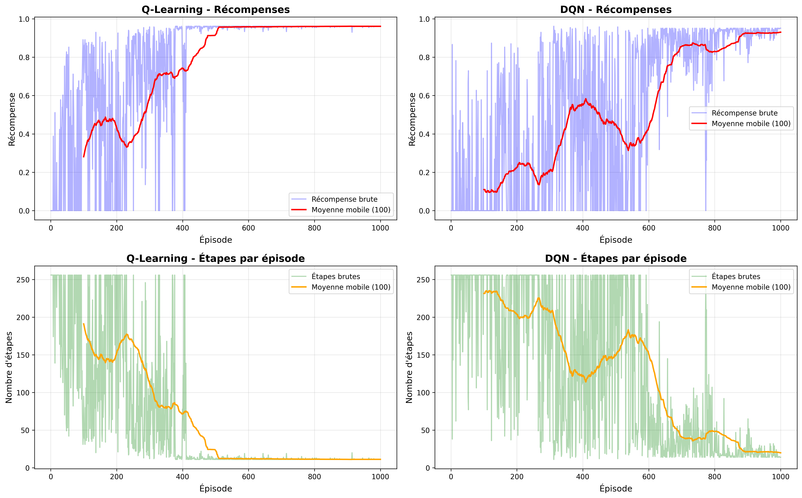

# Rapport de TP - Apprentissage par Renforcement avec MiniGrid

**Auteur:** Oumou SOW   

---

## Table des matières

1. [Introduction](#1-introduction)
2. [Méthodologie](#2-méthodologie)
3. [Résultats Expérimentaux](#3-résultats-expérimentaux)
4. [Discussion Critique](#4-discussion-critique)
5. [Améliorations Futures](#5-améliorations-futures)
6. [Conclusion](#6-conclusion)
7. [Références](#7-références)
8. [Annexes](#8-annexes)

---

## 1. Introduction

### 1.1 Contexte et Objectifs

Ce TP a pour objectif d'implémenter et comparer différents algorithmes d'apprentissage par renforcement sur l'environnement MiniGrid. Les objectifs spécifiques sont:

- Comprendre le fonctionnement de l'environnement MiniGrid
- Implémenter un agent Q-Learning tabulaire
- Implémenter un agent Deep Q-Network (DQN)
- Comparer les performances des deux approches
- Analyser les défis liés à l'exploration et l'exploitation

### 1.2 Environnement MiniGrid

MiniGrid est un environnement d'apprentissage par renforcement conçu pour tester des agents dans des grilles 2D. L'environnement choisi pour ce TP est **MiniGrid-Empty-8x8-v0**, qui consiste en une grille vide de 8x8 cases où l'agent doit atteindre un objectif.

**Caractéristiques:**
- Espace d'observation: [À compléter après exploration]
- Espace d'actions: 7 actions (tourner gauche/droite, avancer, etc.)
- Récompense: +1 pour atteindre l'objectif, 0 sinon
- Episode terminé: Quand l'objectif est atteint ou limite d'étapes dépassée

---

## 2. Méthodologie

### 2.1 Algorithme Q-Learning

#### 2.1.1 Principe

Q-Learning est un algorithme de différence temporelle qui apprend une fonction de valeur action-état Q(s,a) sans avoir besoin d'un modèle de l'environnement.

**Équation de mise à jour:**

```
Q(s,a) ← Q(s,a) + α[r + γ max_a' Q(s',a') - Q(s,a)]
```

Où:
- α (learning rate): [Valeur utilisée]
- γ (discount factor): [Valeur utilisée]
- r: récompense reçue
- s': état suivant

#### 2.1.2 Implémentation

**Structure de données:**
- Table Q: Dictionnaire Python avec états comme clés
- Politique epsilon-greedy pour l'exploration

**Hyperparamètres choisis:**
```
learning_rate = [valeur]
gamma = [valeur]
epsilon_start = [valeur]
epsilon_end = [valeur]
epsilon_decay = [valeur]
```

**Justification des choix:**
[Expliquer pourquoi vous avez choisi ces valeurs]

### 2.2 Algorithme Deep Q-Network (DQN)

#### 2.2.1 Principe

DQN utilise un réseau de neurones profond pour approximer la fonction Q, permettant de gérer des espaces d'états continus ou de grande dimension.

**Innovations clés:**
- Experience Replay: Stockage et réutilisation des transitions
- Target Network: Réseau séparé pour stabiliser l'apprentissage

#### 2.2.2 Architecture du réseau

```
Input Layer: [taille] neurones
Hidden Layer 1: [taille] neurones + ReLU
Hidden Layer 2: [taille] neurones + ReLU
Output Layer: [nombre d'actions] neurones
```

**Hyperparamètres:**
```
learning_rate = [valeur]
batch_size = [valeur]
buffer_capacity = [valeur]
target_update_frequency = [valeur]
```

### 2.3 Protocole d'Entraînement

- Nombre d'épisodes d'entraînement: [valeur]
- Nombre maximum d'étapes par épisode: [valeur]
- Nombre d'épisodes d'évaluation: [valeur]
- Critère de succès: [définition]

---

## 3. Résultats Expérimentaux

### 3.1 Courbes d'Apprentissage

#### 3.1.1 Q-Learning



**Observations:**
- [Décrire l'évolution de la récompense]
- [Décrire l'évolution du nombre d'étapes]
- [Convergence observée à quel épisode?]

#### 3.1.2 Deep Q-Network


**Observations:**
- [Décrire l'évolution de la récompense]
- [Décrire l'évolution de la loss]
- [Stabilité de l'apprentissage]

### 3.2 Performances en Évaluation


| Métrique | Q-Learning | DQN |
|----------|-----------|-----|
| Récompense moyenne | [valeur ± std] | [valeur ± std] |
| Étapes moyennes | [valeur ± std] | [valeur ± std] |
| Taux de succès | [valeur]% | [valeur]% |
| Temps d'entraînement | [temps] | [temps] |

### 3.3 Distribution des Récompenses


**Analyse:**
- [Forme de la distribution pour chaque agent]
- [Variance observée]
- [Comparaison de la robustesse]

### 3.4 Expérimentations Supplémentaires

#### 3.4.1 Impact du Learning Rate

[Tableau ou graphique montrant l'impact du learning rate]

**Résultats:**
- [Observations]

#### 3.4.2 Impact de l'Exploration (Epsilon)

[Tableau ou graphique montrant l'impact d'epsilon]

**Résultats:**
- [Observations]

---

## 4. Discussion Critique

### 4.1 Points Forts des Approches

#### Q-Learning
**Avantages:**
- Simplicité d'implémentation
- Interprétabilité de la table Q
- Pas de dépendance à une architecture de réseau
- [Autres avantages observés]

**Résultats positifs:**
- [Ce qui a bien fonctionné]

#### Deep Q-Network
**Avantages:**
- Scalabilité à des espaces d'états plus grands
- Capacité de généralisation
- [Autres avantages observés]

**Résultats positifs:**
- [Ce qui a bien fonctionné]

### 4.2 Limitations et Défis Rencontrés

#### 4.2.1 Exploration vs Exploitation

**Problème identifié:**
[Décrire le dilemme observé dans vos expériences]

**Solutions testées:**
- [Stratégie 1]
- [Stratégie 2]

**Résultats:**
[Impact des solutions]

#### 4.2.2 Convergence de l'Algorithme

**Q-Learning:**
- Convergence observée après [X] épisodes
- Stabilité: [Stable/Instable]
- Plateau de performance à: [valeur]

**DQN:**
- Convergence observée après [X] épisodes
- Problèmes rencontrés: [catastrophic forgetting, instabilité, etc.]
- Solutions appliquées: [target network, gradient clipping, etc.]

#### 4.2.3 Représentation de l'État

**Défi:**
[Comment avez-vous représenté l'état pour chaque algorithme?]

**Impact:**
[Comment cela a affecté les performances?]

#### 4.2.4 Complexité Computationnelle

| Algorithme | Temps par épisode | Mémoire utilisée | Scalabilité |
|------------|-------------------|------------------|-------------|
| Q-Learning | [temps] | [mémoire] | [analyse] |
| DQN | [temps] | [mémoire] | [analyse] |

### 4.3 Comparaison Critique

**Meilleur agent selon:**
- Performance pure: [Q-Learning/DQN]
- Vitesse d'apprentissage: [Q-Learning/DQN]
- Stabilité: [Q-Learning/DQN]
- Efficacité computationnelle: [Q-Learning/DQN]

**Justification:**
[Argumenter vos conclusions]

---

## 5. Améliorations Futures

### 5.1 Améliorations Algorithmiques

#### Pour Q-Learning:
1. **Fonction value iteration**: [Description]
2. **SARSA**: Utiliser la vraie action suivie plutôt que max
3. **Eligibility traces**: [Description]

#### Pour DQN:
1. **Double DQN**: Réduire le biais de surestimation
2. **Prioritized Experience Replay**: Échantillonner les transitions importantes
3. **Dueling DQN**: Séparer la valeur d'état et l'avantage d'action
4. **Rainbow DQN**: Combiner plusieurs améliorations

### 5.2 Application à d'Autres Environnements

**Environnements plus complexes:**
- MiniGrid-DoorKey-8x8-v0: Navigation avec portes et clés
- MiniGrid-FourRooms-v0: Exploration dans plusieurs pièces
- MiniGrid-Dynamic-Obstacles: Obstacles mobiles

**Adaptations nécessaires:**
[Comment adapter les algorithmes?]

### 5.3 Optimisations Techniques

1. **Parallélisation**: Utiliser plusieurs environnements en parallèle (A3C, PPO)
2. **Hyperparameter tuning**: Recherche systématique (grid search, bayesian optimization)
3. **Curriculum learning**: Augmenter progressivement la difficulté
4. **Transfer learning**: Pré-entraîner sur des tâches similaires

---

## 6. Conclusion

### 6.1 Synthèse des Résultats

[Résumer les principaux résultats et apprentissages du TP]

### 6.2 Compétences Acquises

- Compréhension approfondie de Q-Learning et DQN
- Maîtrise de l'implémentation d'agents RL
- Analyse de performances et debugging
- Visualisation et interprétation de résultats

### 6.3 Perspectives

[Réflexion personnelle sur l'apprentissage par renforcement et ses applications]

---

## 7. Références

1. Sutton, R. S., & Barto, A. G. (2018). *Reinforcement Learning: An Introduction*. MIT Press.

2. Mnih, V., et al. (2015). "Human-level control through deep reinforcement learning". *Nature*, 518(7540), 529-533.

3. MiniGrid Documentation: https://minigrid.farama.org/

4. Gymnasium Documentation: https://gymnasium.farama.org/

5. [Ajouter d'autres références utilisées]

---

## 8. Annexes

### Annexe A: Code Source

[Lien vers le repository GitHub ou code complet]

### Annexe B: Hyperparamètres Testés

| Paramètre | Valeur 1 | Valeur 2 | Valeur 3 | Meilleure |
|-----------|----------|----------|----------|-----------|
| learning_rate | | | | |
| epsilon_decay | | | | |
| ... | | | | |

### Annexe C: Logs d'Entraînement

```
[Extraits des logs les plus pertinents]
```

### Annexe D: Analyse des Erreurs

[Exemples d'échecs de l'agent avec analyse]

---

**Note:** Ce rapport doit être complété avec vos résultats expérimentaux réels, vos observations et votre analyse critique personnelle.
